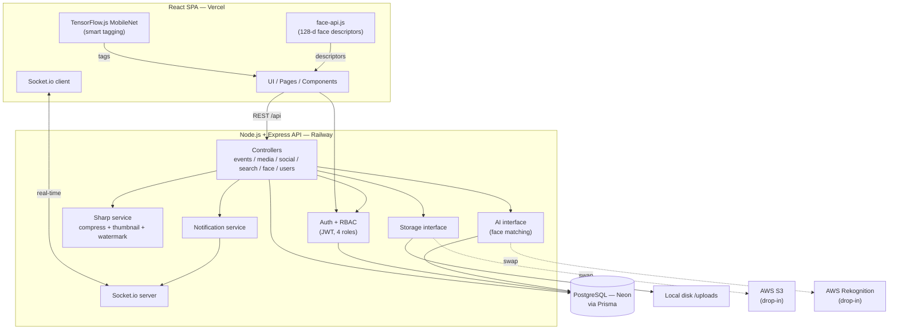
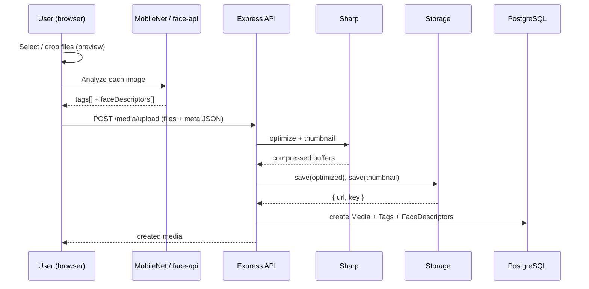
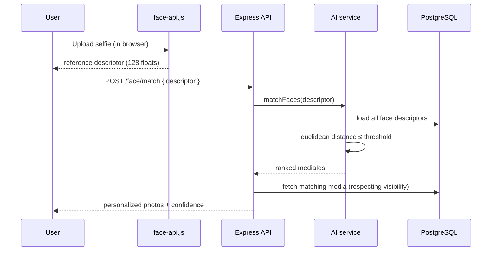

# Architecture

## System overview

## Upload data flow

## Facial recognition ("Find my photos")

## Real-time notifications

When a social action occurs (like / comment / tag), the relevant controller calls the
notification service, which (1) persists a `Notification` row and (2) emits a `notification`
event over Socket.io to the recipient's private room (`user:<id>`). The client shows a toast
and updates the unread badge instantly.

## Design principles

- **Client-side AI** keeps the backend dependency-light and key-free, while remaining swappable for managed cloud AI.
- **Driver interfaces** (`services/storage`, `services/ai`) isolate infrastructure choices from business logic.
- **Stateless API + JWT** so the backend scales horizontally; sticky sessions aren't required (Socket.io can use a Redis adapter for multi-instance scale).
- **Cursor pagination** powers the infinite-scroll gallery efficiently at any dataset size.
- **Scalability path for face search:** the current in-JS nearest-neighbour scan can be replaced with a `pgvector` similarity index or Rekognition collections without API changes.
