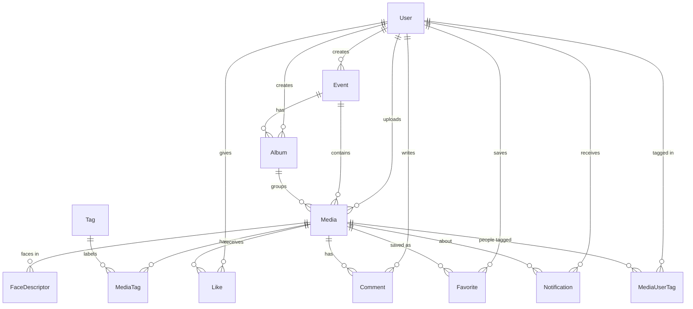

# Database Schema

PostgreSQL, modelled with Prisma. The authoritative source is
[`backend/prisma/schema.prisma`](../backend/prisma/schema.prisma).

## Entity-relationship diagram



## Tables

### User
Accounts with role-based permissions. `faceDescriptor` holds the optional reference-selfie embedding for personalized discovery.

| Column | Type | Notes |
|--------|------|-------|
| id | String (cuid) | PK |
| email | String | unique |
| password | String | bcrypt hash |
| name | String | |
| role | Role | `ADMIN` \| `PHOTOGRAPHER` \| `CLUB_MEMBER` \| `VIEWER` |
| clubName | String? | |
| avatarUrl | String? | |
| faceDescriptor | Float[] | 128-d reference selfie embedding |
| createdAt / updatedAt | DateTime | |

### Event
| Column | Type | Notes |
|--------|------|-------|
| id | String | PK |
| name | String | indexed |
| description | String? | |
| category | String? | indexed (sort/filter) |
| clubName | String? | |
| date | DateTime? | indexed (sort) |
| coverUrl | String? | |
| visibility | Visibility | `PUBLIC` \| `PRIVATE` |
| createdById | FK → User | |

### Album
Event-wise grouping of media. `id, name, description, eventId (FK), createdById (FK)`.

### Media
The core asset. Photos and videos.

| Column | Type | Notes |
|--------|------|-------|
| id | String | PK |
| type | MediaType | `IMAGE` \| `VIDEO` |
| url | String | public/optimized URL |
| thumbnailUrl | String? | generated thumbnail |
| storageKey | String? | key/path in storage backend |
| originalName, mimeType, fileSize, width, height | | metadata |
| caption | String? | |
| visibility | Visibility | public vs members-only |
| eventId | FK → Event | indexed |
| albumId | FK → Album? | indexed |
| uploadedById | FK → User | |

### Tag / MediaTag
`Tag(name unique)`. `MediaTag` is the join with `confidence` (0–1) and `source` (`ai`/`manual`) — AI tags come from MobileNet.

### FaceDescriptor
Faces detected within a media item: `descriptor Float[]` (128-d) + `boundingBox Json`. Used for facial-recognition search.

### Like / Favorite
Composite-PK join tables `(userId, mediaId)`.

### Comment
`id, text, userId (FK), mediaId (FK), createdAt`.

### MediaUserTag
"Tag friends" — `(mediaId, taggedUserId)` unique, plus `taggedById`.

### Share
Shareable tokens for QR/link sharing: `token unique, mediaId?, eventId?, createdById`.

### Notification
`type` (`LIKE`/`COMMENT`/`TAG`/`SHARE`/`FAVORITE`/`SYSTEM`), `message`, `read`, `recipientId (FK)`, `actorId (FK?)`, `mediaId (FK?)`.

## Enums

```
Role             = ADMIN | PHOTOGRAPHER | CLUB_MEMBER | VIEWER
MediaType        = IMAGE | VIDEO
Visibility       = PUBLIC | PRIVATE
NotificationType = LIKE | COMMENT | TAG | SHARE | FAVORITE | SYSTEM
```

## Indexing notes
Indexes exist on event name/date/category (sorting & filtering), media event/album/visibility/createdAt (feed + cursor pagination), tag name (search), and notification recipient/read (inbox). For large-scale face search, add a `pgvector` column + IVFFlat index on `FaceDescriptor.descriptor`.
